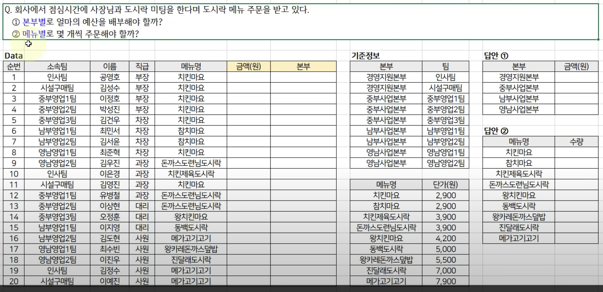

# Accounting

## 회계 1

---

https://docs.google.com/spreadsheets/d/1VEndX1lPavOsfebkqnlhpQMifnokIMOJrsVcorqmyY8/edit?usp=sharing

### 기업과 정부의 재무상태표를 습관적으로 그리고 반복적으로 찾아본다.

- [기업](http://dart.fss.or.kr/)
- [정부](http://www.alio.go.kr/home.do)

### 복식부기

---

https://docs.google.com/spreadsheets/d/1SI1lB57E6qOrBDO0XgqDTbjl3Ibi70Rd7McGkt3t570/edit?usp=sharing

거래의 이중성

금액을 차변 대변으로 나누어 두번 적는 것을 복식부기라 함.
하나 적는 것 -> 분개(Journal Entry)

1. 규칙

- 차변 대변 위치에 따라 자산이 증가하고 부채가 감소한다.
- 자기 위치에 적으면 증가한거고 반대편에 감소한거다.

2. 자리를 잡고 있는 이유?

- 차변 = 나의 소유의 모든 것 | ex) 차, 건물, 자동차, 부동산, 돈
- 대변 = 그 자산을 누구의 돈으로 샀는가? | ex) 부채(남의 돈) 자본(나의 돈)

3. 차변에다가 자산을 먼저 적은 다음에 대변에다가 그게 무슨 돈인지, 누구의 돈으로 샀는지 적는 게 좋다.

- 자산의 재원이 어디서 왔는지 표시
- 재무상태에 대해서 판단 가능

회계정보는 복식부기로 작성하는 것이 원칙!

## exel

---

### 기본수식

##### 공통순서

1. 범위 지정 | 고정 $ 범위 f4
2. 명 선택

- countif()

  - 이 조건에 해당하면 세어라

- sumif()
  - 조건에 해당하는 값 더하기
- vlookup()

  - 단가 지정 flase를 넣어준다.

- 서식지정
  - ctrl + 1 을 누르면 셀서식으로 간다. (빈칸 없이 세 자리 끊어일기 가능)

### 피벗테이블

- 어떤 값이든 자유자재로 보고 양식을 생성할 수 있다.

#### 순서

1.  삽입
2.  피벗테이블
3.  범위 지정

### 예제

https://docs.google.com/spreadsheets/d/13PjdKG8zL5CZboRly89D_PIVJ-dqBtKBvmeW_LBkhE4/edit?usp=sharing

#### 질문 및 실수 오답노트

- 피벗테이블 어떻게 만들어요?
- 함수를 사용할 때는 = 붙이세요
- vlookup함수 범위 정하는거
